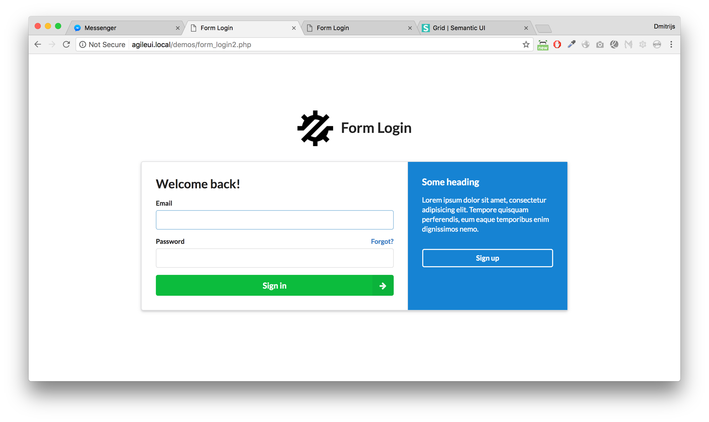

Many projects require some sort of authentication before user can access an application. This add-on for Agile Toolkit implements a Login form:



### Installation

Composer require this repository then run the following:

``` php
$app->auth = $app->add(new \atk4\login\Auth(new \atk4\login\User($app->db)));
$app->auth->setUp(); // just run once
```

### Usage

``` php
$app->auth = $app->add(new \atk4\login\Auth(new \atk4\login\User($app->db)));
$app->auth->check();

// only authenticated users allowed
```

### Using your own user model

Login comes with a User model, but in most cases you should probably use your own User model. You do not have to extend the \atk4\login\User class as long as you use this:

``` php
class User extends \atk4\data\Model {
    public $table = 'user';
  
    public $login_field = 'email';
    public $password_field = 'password';
  
    function init() {
    	parent::init();
      
        $this->addField('email');
        $this->addField('password', ['type'=>'password']);
    }
}
```

The password will be stored encrypted using standard PHP encryption.

### Enabling Registration and Password Reminders

Registration and Password Reminder require you to define outbox - a way how to communicate with the user:

``` php
new \atk4\login\Auth([
  new User(),
  'outbox'=> $app->outbox,
  'register'=>true,
  'reminder'=>true
]);
```

The above will enable password reminders and registrations.

### Show user change password

When user is logged in, you can access it through `$auth->user`. You can use a built-in UI for user's password management:

``` php
$auth->addChangePassword($app->layout->menu_user);
```

This will add a new item into User Menu, which will allow user to change their current password.

### User Admin

For a privileged users, you can also use a component for managing users:

``` php
$user_admin = $layout->add(new \atk4\login\UserAdmin($auth));
```

This will show CRUD with list of users and provide you with options to change user passwords, send them reminders, disable users, etc.

UserAdmin extends CRUD so you can easily add more actions:

``` php
// Manually send a message to the user
$user_admin->addAction(new \atk4\sendgrid\Action\Message());
```

